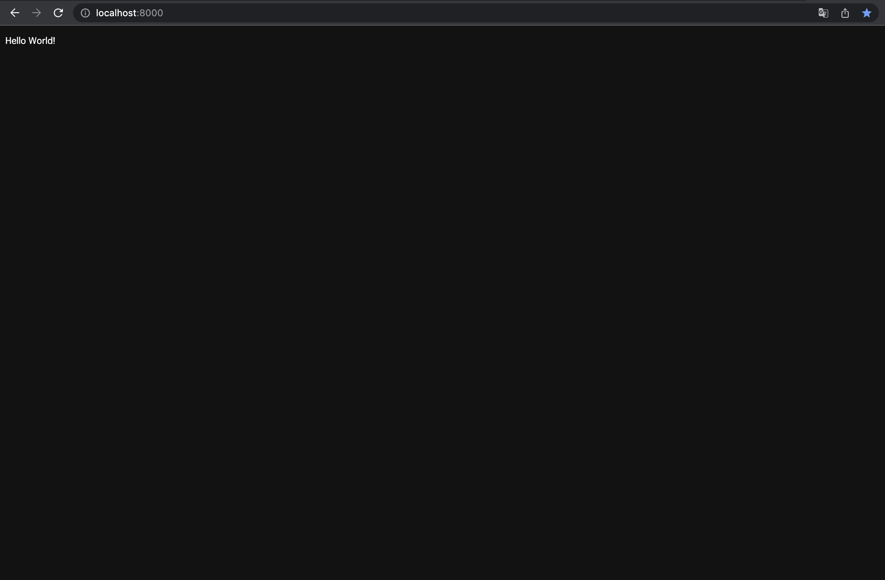
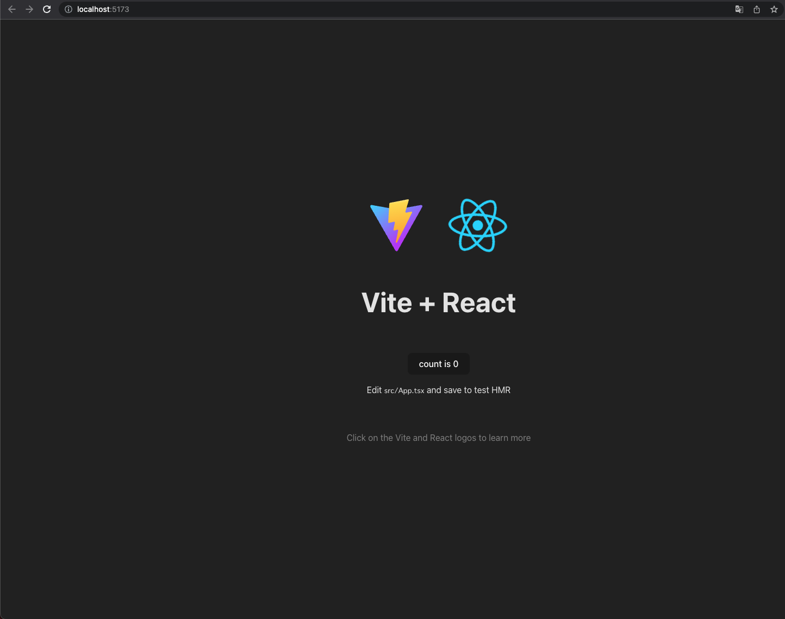

# ブログの開発環境を整える
ブログアプリの開発に向けて，開発環境を Docker で整備します．

## 開発環境の概要
開発環境は M1 MacBook Air 2020 上に構築することを想定していますが，Docker の使える環境であれば対応可能なはずです．
ソフトウェア構成は以下の通りです．

- フロントエンド：[TypeScript](https://www.typescriptlang.org/) + [React](https://ja.legacy.reactjs.org/)
- バックエンド：[Golang](https://go.dev/)
- データベース：[PostgreSQL](https://www.postgresql.org/)
- ストレージ：[Minio](https://min.io/)

## Docker のインストール
まず，[Install Docker Desctop for Mac](https://docs.docker.com/desktop/mac/install/) から Apple Silicon 向けの Docker をダウンロード，インストールします．
この状態で Docker Desktop は使えるようになりますが，コマンドラインからは使えないので，以下のコマンドでシンボリックリンクを作成します．

```bash
$ ln -s /Applications/Docker.app/Contents/Resources/bin/docker /usr/local/bin/docker
```

これで ```docker``` コマンドが CLI から叩けるようになります．

## Go の開発環境
まず，まっさらな Go の環境を立ち上げ，```go.mod``` を準備します．

```backend/Dockerfile```:
```dockerfile
FROM golang:1.20.4-alpine
WORKDIR /app
```

```docker-compose.yml```:
```yml
version: '3'

services:
  blog_backend:
    build:
      context: .
      dockerfile: ./backend/Dockerfile
    container_name: blog_backend_container
    environment:
      - TZ=Asia/Tokyo
    ports:
      - 8000:8000
    tty: true
    volumes:
      - ./backend:/app
```

上記のファイルを用意したら，ビルドして Go のプロジェクトを初期化します．
プロジェクトの名称は好きなように付けてください．

```bash
$ docker compose build
$ docker compose run blog_backend go mod init example.com/go_project
```

すると，```go.mod``` ファイルが生成されるます．
続いて，必要なパッケージを追加して開発環境のコンテナを立ち上げます．
まず，```backend/Dockerfile``` を以下のように編集し，ホットリロードに対応させます．
```backend/.air.toml``` の中身は長くなるので直接ファイルを参照してください．

```Dockerfile
FROM golang:1.20.4-alpine

WORKDIR /app

# # ホットリロードツール Air の導入
RUN apk update && apk add git
RUN go install github.com/cosmtrek/air@v1.43.0

# # Air でアプリケーションを起動
CMD ["air", "-c", ".air.toml"]
```

動作確認用に簡易な HTTP サーバーを立ち上げてみます．

```backend/main.go```
```go
package main

import (
	"fmt"
	"net/http"
)

func handler(w http.ResponseWriter, r *http.Request) {
	fmt.Fprintf(w, "Hello World!")
}

func main() {
	http.HandleFunc("/", handler)
	http.ListenAndServe(":8000", nil)
}
```

```Dockerfile``` を変更したのでビルドし直して，コンテナを立ち上げてみます．

```bash
$ docker compose build
$ docker compose up blog_backend
```

ブラウザから [http://localhost:8000](http://localhost:8000) にアクセスして，以下の画面が表示されれば環境構築完了です．

<div align="center">
    
</div>

## React + TypeScript の開発環境
基本的な流れは Go の環境構築と同じです．
まずは，```Dockerfile``` と ```docker-compose.yml``` を用意します．
ビルドツールとして ```Vite``` を使ってみようと思うので，それもインストールしています．

```frontend/Dockerfile```:
```dockerfile
FROM node:20.1.0-alpine

WORKDIR /app

RUN npm insrall -g npm@9.6.6 && npm install -g vite@4.3.5
```

```docker-compose.yml```:
```yml
version: '3'

services:
  blog_frontend:
    build:
      context: .
      dockerfile: ./frontend/Dockerfile
    container_name: blog_frontend_container
    environment:
      - TZ=Asia/Tokyo
    ports:
      - 5173:5173
    tty: true
    volumes:
      - ./frontend:/app
```

ビルドして React のプロジェクトを作成します．

```bash
$ docker compose build
$ docker compose run blog_frontend

# 以下コンテナ内

$ cd ..
$ yarn create vite app --template=react-ts
```

これで，React + TypeScript の開発に必要なファイルが一式 ```frontend``` ディレクトリに展開されます．
コンテナ内で ```Vite``` を起動する場合には，以下のファイルを編集します． 

```frontend/package.json```
```json
{
  ...
  "scripts": {
    // 変更前
    "dev": "vite",
    // 変更後
    "dev": "vite --host",
    ...
  },
  ...
}
```

```frontend/vite.config.ts```
```ts
export default defineConfig({
  plugins: [react()],
  // 以下を追記
  server: {
    host: true,
  },
});
```

さらに，```Dockerfile``` 編集します．

```dockerfile
FROM node:20.1.0-alpine

WORKDIR /app
RUN mkdir -p node_modules 

RUN npm insrall -g npm@9.6.6 && npm install -g vite@4.3.5

CMD ["/bin/bash", "-c", "yarn install && yarn dev"]
```

イメージをビルドし直してコンテナを起動します．

```bash
$ docker compose build
$ docker compose up blog_frontend
```

[http://localhost:5173](http://localhost:5173) にアクセスして Vite + React のページが表示されれば OK です．

<div align="center">
    
</div>